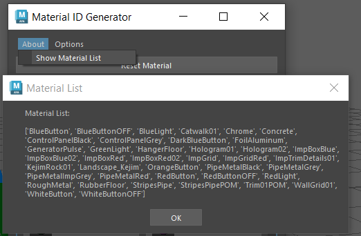

# Maya Tools and Scripts
This repo contains Maya scripts mostly written for developers and artists I'm working with for a game project - Kyber Initiative.
## Material ID Tool
The Material ID Tool allows a user to apply generated IDs to objects in Maya for visualization purposes and easy texture assignment when moving assets to other DCCs. The tool was originally created for asset migration to Unreal Engine 5 but is not restricted. 

Features include:
* Automatically generate materials and shading groups with random colors for predefined IDs
* Apply materials to objects with a single button click
* Reset object materials to default 'lambert1' if mistakes are made
* Select all objects with a specific material by right clicking the button

UI Features include:
* Buttons are labeled with color and ID for easy identification
* Button section in scrollable area so window can be resized to desired fit
* Change the number of columns in the button grid to user preference which is automatically saved and remembered for future use


### Installation

The script for the Material Id Tool is inside the scripts folder - ```materialId.py```

To utilize the script with Maya:
1. Save python file to your "scripts" folder in your project. For Windows users, this is usually in C:\Users\\[yourUser]\Documents\maya
2. Open the script editor in your scene. There are several ways: [MayaHelpScriptEditor](https://help.autodesk.com/view/MAYAUL/2023/ENU/?guid=GUID-7C861047-C7E0-4780-ACB5-752CD22AB02E)
3. Open the materialId.py script in the script editor and run

The script can also be saved to your shelf for easy access. Here is some Maya Documentation to save scripts to shelf: [MayaHelpSaveToShelf](https://help.autodesk.com/view/MAYAUL/2024/ENU/?guid=GUID-C693E884-F81A-4858-B5D6-3856EB8F394E)

### Generate Materials
When you run the script for the first time, it will generate all the materials and shader groups for the IDs predefined in the list. This list can be adjusted in the code if desired.

It will assign random colors to each material. There is a random seed defined so each artist that runs the script will generate the same random colors for each material. This can be edited in the code if desired.

Materials and shading groups will only be generated if they do not already exist. The script searches the names of the existing materials and shading groups to determine if they already exist.

### Apply and Reset Materials
To apply a material, simply select the object(s) that you want to apply the material to. Then, click the button that corresponds to the material you want to apply. Any existing material on the object will be overwritten by the selected material. This will also work for faces and/or parts of an object. If no objects are selected, the script will return an error: ```No renderable object is selected for assignment```.

Resetting materials before clicking the newly desired is not necessary. However, if you want to return the object to Maya's default state, use the "Reset Material" button. The "Reset Material" button returns the object's material to Maya's default 'lambert1'. 

### Select All Objects with Specfic Material
To select all objects with a specific material, simply right click on the button that corresponds to the material you want to select for. All objects that have that material applied will be selected in the viewport. TThis will also work for faces and/or parts of an object. Any previous selections will be cleared. If no objects have that material, nothing will occur. 

### Status Tips for UI
When hovering over each button, a helpful status tip will show at the bottom left of the Maya Window to remind users of how to activate apply versus select actions. 

Here is an example:


### Change Number of Columns for the Button Grid
The first time the script is run, the UI will default to 2 columns for the button grid. However, this can be changed under the "Options" menu in the UI.


A new window will open asking for your preference and the main UI will close. This allows the script to re-build the UI once the user selects a new number. Clicking "OK" will save the new number as the number of columns for the button grid. Clickin "Cancel" will reopen UI without any changes. 

This number is saved in settings so the most recently set number will be what is used everytime the script runs, until changed again.

### Show Material List
In the 'About' menu, there is the ability to show all the materials in the list if needed for troubleshooting. Clicking 'Show Material List' will open a dialog window with all the predefined materials the script is basing all materials on.




### Features to Add
TODO:

* ~~Add context menu to select all objects with a specific material~~ DONE
* Add a "add new material" button that appends to initial list

## License
[MIT](https://choosealicense.com/licenses/mit/)
